# GNU GCC Profiling (gprof)
El perfilado de programas es una técnica utilizada para analizar el comportamiento de un programa durante su ejecución. Permite identificar cuellos de botella o partes del código que consumen más tiempo de ejecución o recursos, lo que a su vez facilita la optimización del rendimiento. En este trabajo práctico, vamos a explorar cómo utilizar herramientas de perfilado para mejorar la eficiencia de un programa mediante el uso de gprof y perf.

### Profiling
El profiling, o perfilado, es el proceso de medir y analizar el comportamiento de un programa. Esto incluye identificar cuánto tiempo tarda en ejecutarse cada función, cuántas veces se llama a una función y qué recursos (como memoria o ciclos de CPU) está utilizando. Con esta información, los programadores pueden encontrar las áreas del código que requieren optimización.

Al compilar el programa con la opción -pg, se habilita el soporte de perfilado en el código. Esto permite que el programa registre datos de rendimiento, como el tiempo de ejecución de cada función, lo que ayuda a identificar cuellos de botella (partes del programa que tardan mucho tiempo en ejecutarse). Una vez que el programa se ejecuta, se genera un archivo de datos (gmon.out) que contiene información sobre el rendimiento. Luego, gprof analiza este archivo y genera un reporte, mostrando qué funciones son las más costosas en términos de tiempo de ejecución. Esto te da una visión clara de qué partes del programa deberían ser optimizadas.

### Paso 1: creación de perfiles habilitada durante la compilación
Se compiló los archivos test_gprof.c y test_gprof_new.c con opciones para habilitar el perfilado (-pg), mostrando todos los warnings (-Wall) y generando un ejecutable llamado test_gprof:
'''
gcc -Wall -pg test_gprof.c test_gprof_new.c -o test_gprof
'''

### Paso 2: Ejecutar el código
Se ejecutó el programa test_gprof generado en el paso anterior:
'''
./test_gprof
'''
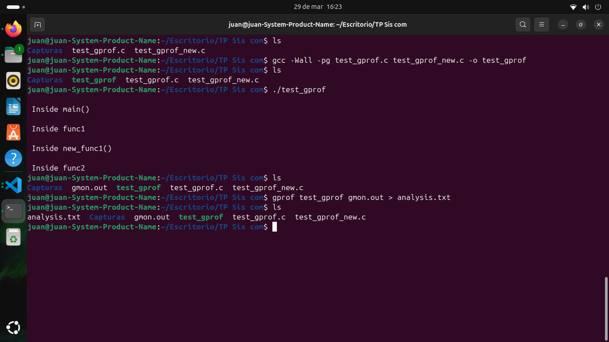

### Paso 3: Ejecute la herramienta gprof
Se ejecutó la herramienta gprof sobre el archivo ejecutable test_gprof y el archivo de datos gmon.out, guardando el análisis en el archivo analysis.txt:
'''
gprof test_gprof gmon.out > analysis.txt
'''

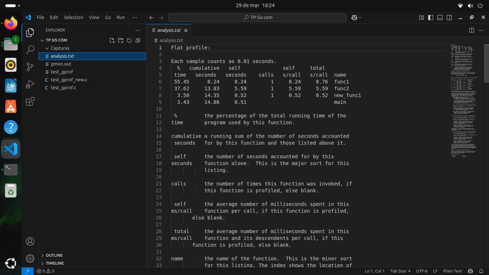

--- 
# Customize gprof output using flags

### 1. Suprima la impresión de funciones declaradas estáticamente (privadas) usando -a
'''
gprof -a test_gprof gmon.out > analysis.txt
'''
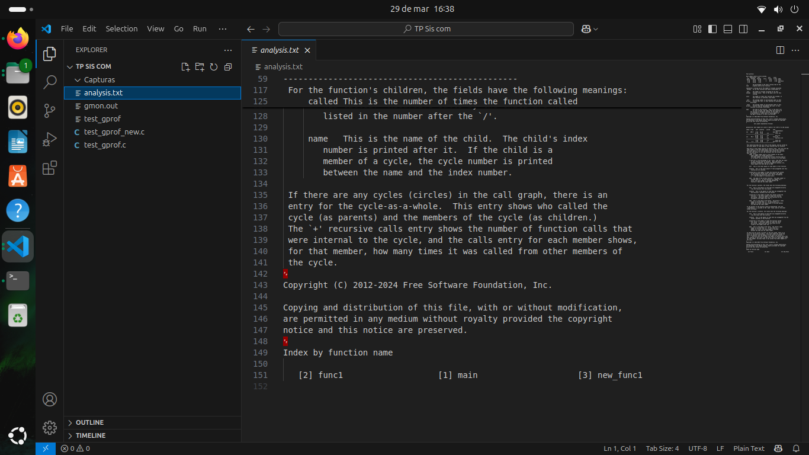

### 2. Elimine los textos detallados usando -b
'''
gprof -b test_gprof gmon.out > analysis.txt
'''
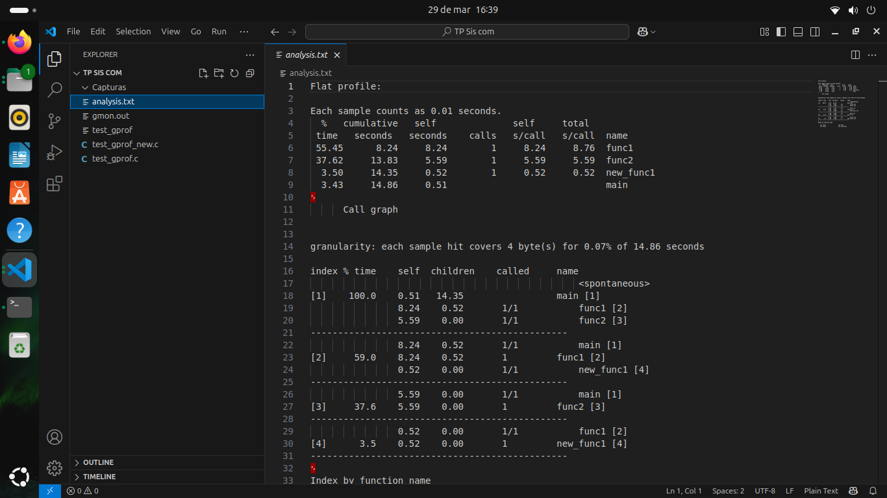

### 3. Imprima solo perfil plano usando -p
'''
gprof -p -b test_gprof gmon.out > analysis.txt
'''
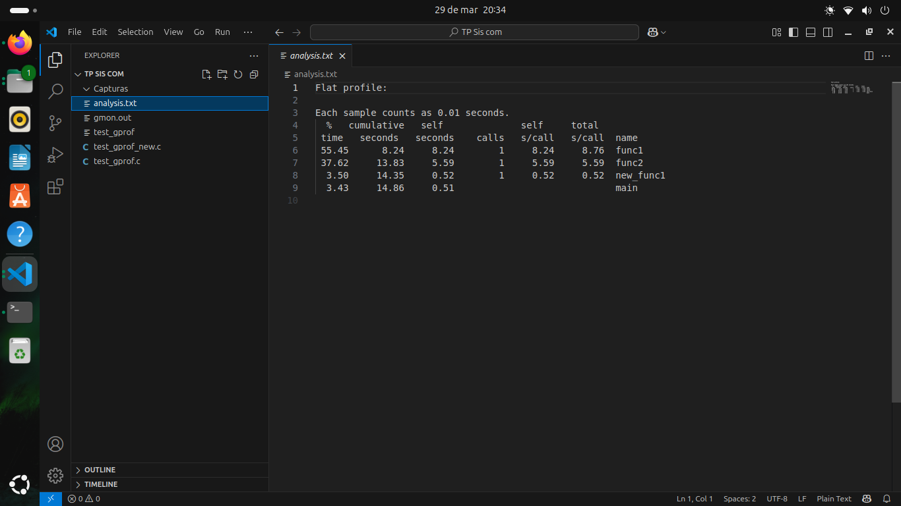

### 4. Imprimir información relacionada con funciones específicas en perfil plano
'''
gprof -pfunc1 -b test_gprof gmon.out > analysis.txt
'''
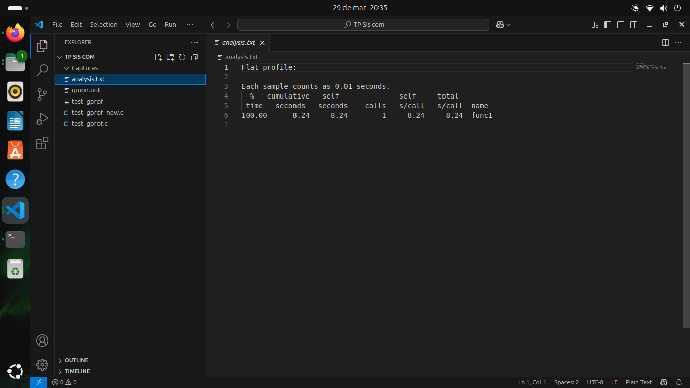

---
# Genere un gráfico
Los gráficos proporcionan una representación visual del perfilado, lo que facilita la comprensión de los datos. A veces, los reportes de texto pueden ser complejos o difíciles de interpretar, pero un gráfico de flujo o un gráfico de llamadas (llamadas de funciones) puede mostrar de forma intuitiva dónde se concentran los mayores tiempos de ejecución.
gprof2dot convierte los datos de gprof en un archivo DOT, que es un formato estándar para describir gráficos. Luego, graphviz convierte ese archivo DOT en una imagen (como PNG) que visualiza las relaciones y el tiempo de ejecución de las funciones, permitiendo ver de manera clara y directa las secciones de tu código que necesitan optimización.

### Entorno python
Se instaló Python 3 y el gestor de paquetes pip en entorno virtual (en este caso llamado myenv) para aislamiento de dependencias, control de versiones, facilitar la instalación de paquetes adicionales y evitar conflictos con otras aplicaciones:
'''
sudo apt install python3 python3-venv python3-pip
python3 -m venv myenv
source myenv/bin/activate
'''

### instalacion y graficacion de gprof2dot y graphviz:
gprof2dot convirtió el archivo analysis.txt a un archivo DOT (gráfico de gprof), que se guardó como output.dot. 
graphviz convirtió el archivo DOT a una imagen PNG utilizando graphviz y se guardó el resultado como output.png:

Instalacion:
'''
pip install gprof2dot
sudo apt install graphviz
'''
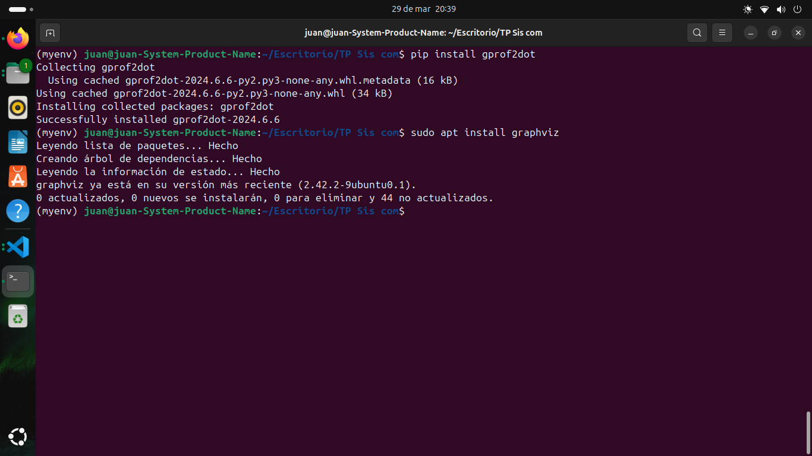

Graficacion:
'''
gprof test_gprof gmon.out > analysis.txt
gprof2dot -f prof analysis.txt -o output.dot
dot -Tpng output.dot -o output.png
'''
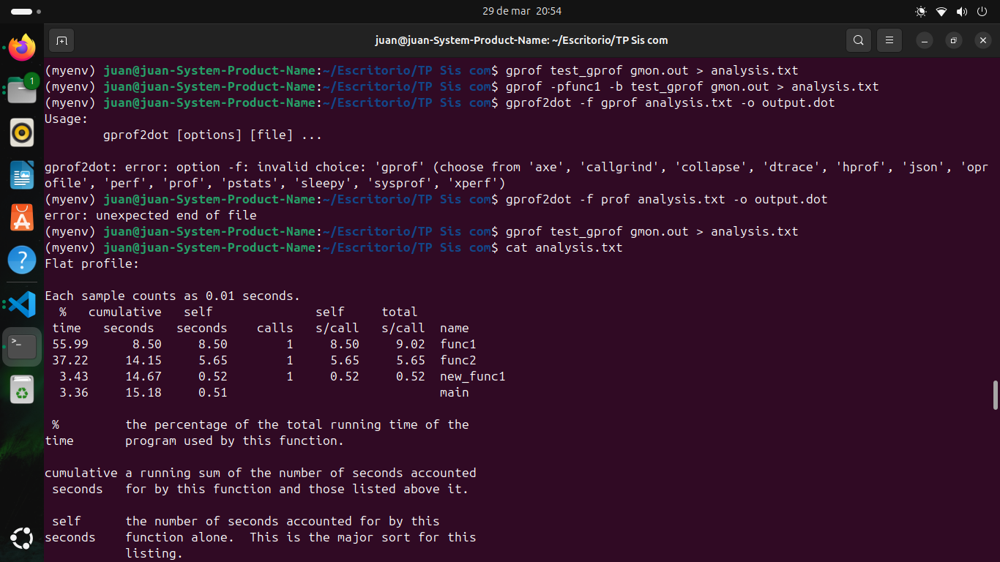

Imagen generada: 
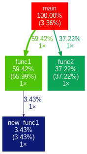
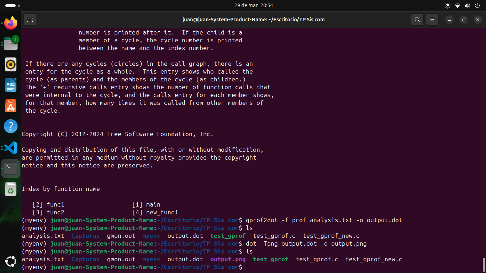

---
# Profiling con linux perf
perf es una herramienta que realiza un perfilado estadístico del rendimiento del programa. A diferencia de gprof, que tiene un mayor impacto en el rendimiento del programa (ya que genera datos de ejecución detallados), perf realiza una muestra del comportamiento del programa, lo que lo hace mucho más rápido y con menos sobrecarga. Es ideal para obtener una visión general del rendimiento sin interrumpir demasiado la ejecución del programa.
perf permite capturar información sobre ciclos de CPU, uso de memoria y otras métricas, lo que puede ser útil cuando deseas una visión más completa del comportamiento de tu programa en un entorno real, sin tener que preocuparte tanto por la sobrecarga de mediciones exhaustivas.

### Instalación
Instalación de las herramientas de Linux correspondientes a la versión 6.11.0-19-generic del kernel:
'''
sudo apt install linux-tools-common
uname -r
sudo apt install linux-tools-6.11.0-19-generic
'''
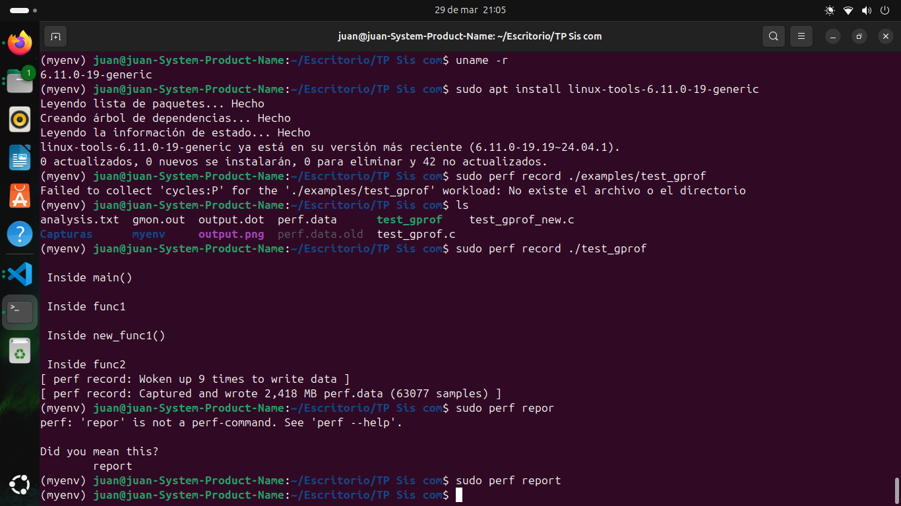

### Ejecución
Se registró la ejecución del programa test_gprof para generar datos de perfil utilizando perf. Se muestra además un reporte interactivo de los datos de perfil generados por perf:
'''
sudo perf record ./test_gprof
sudo perf report
'''
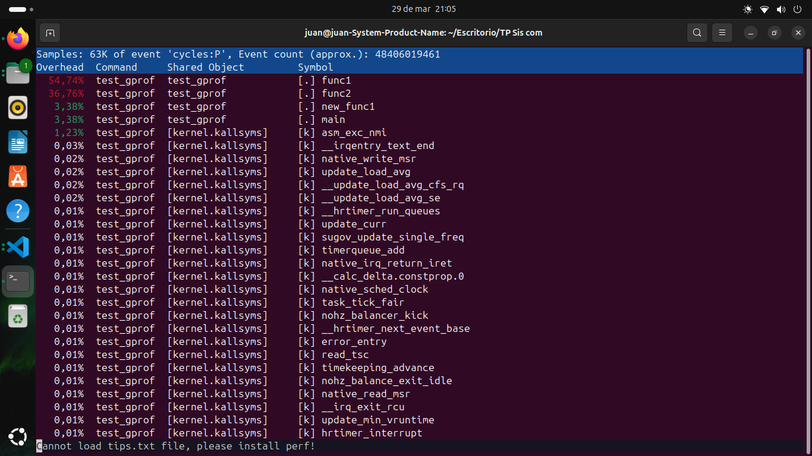